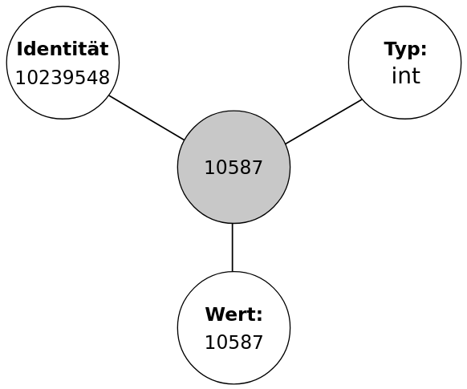

Variablen und Datentypen
========================
Variablen in Python werden genauso wie in anderen Programmiersprachen zum Zwischenspeichern von Werten und Objekten verwendet.

Das Erstellen einer neuen Variable erfolgt über einen Referenznamen, der einem Objekten mittels "``=``" zugeordnet wird. Auf der linken Seite des Gleichzeichens steht der neue Name und auf der rechten Seite das Objekt, welches den Namen bekommen soll. 

.. code-block:: python

    pi = 3.1415

Die Variable kann über den Namen aufgerufen und bearbeitet werden. Der folgende Quellcode verwendet die Variable "pi", um den Bogenmaß zu bestimmen.

.. code-block:: python

    RHOGON = 200.0 / pi
    RHODEG = 180.0 / pi

Der Datentyp besagt, welche Art von Wert eine Variable besitzt und welche Operationen an dem Objekt durchgeführt werden können. In Python wird der Datentyp der Variable nicht zusätzlich deklariert. Die Daten, Funktionen und andere Sprachelemente werden von Objekten repräsentiert. Ein Objekt besitzt drei Merkmale: **Wert**, **Typ** und **Identität**. Beispielsweise eine Ganzzahl gehört zu dem Typ *integer*. Steht die Zahl in Anführungsstrichen, so handelt es sich um eine Zeichenkette, *string*.

Der Typ des Objektes kann mit der Funktion *type()* abgefragt werden. Die Identität dient der Identifizierung eines Objektes. Zwei Objekte mit den selben Wert aber unterschiedlicher Identität sind **gleich** aber nicht **identisch**. Die Identität kann mit der Funktion *id()* abgefragt werden. Zwei Variablen können auf das selbe Objekt zeigen.

    Repräsentation der Zahl 10587 durch ein Objekt.

Zahlen
------

Zeichenketten
-------------

Listen
------

