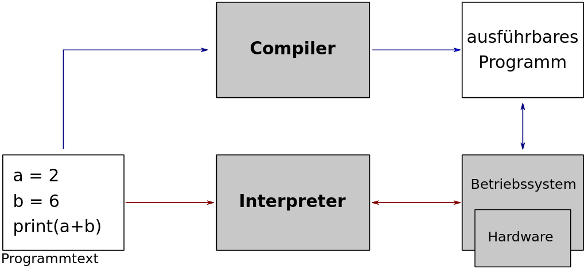

Warum programmieren lernen?
===========================

Wer viel mit der Datenerfassung und -auswertung beschäftigt ist, stellt auch sehr schnell fest, dass dabei oft angepasste Lösungswege erforderlich sind, die von Standardprogrammen nicht angeboten werden. Keine Software ist in der Lage, alle Anwendungsszenarien und Funktionen abzudecken, insbesondere, wenn es sich dabei um ein anspruchsvolles Messverfahren bzw. ein Messkonzept handelt, bei dem mehrere Messgeräte unterschiedlicher Art involviert sind. Die fortgeschrittenen Programme verlangen häufig Lizenzgebühren. Das Programmieren ermöglicht Ihnen, eigene Mechanismen und Prozesse für den Computer zu definieren. Viele der Aufgaben lassen sich meistens auch automatisieren. Ein Programm definiert für den Computer klare Anweisungen darüber, welche Schritte ausgeführt werden sollen. Somit können Sie komplexere Messsysteme definieren werden. Programmieren gehört heutzutage zu den Werkzeugen, die ein Ingenieur beherrschen muss.

Was ist eine Skriptsprache?
---------------------------

.. line-block::
    Die Programmiersprachen lassen sich hauptsächlich in zwei Gruppen unterteilen, nämlich in die **kompilierten** und **interpretierbaren** Programmiersprachen.

    Ein **Compiler** übersetzt (kompiliert) den kompletten Quellcode und erzeugt ein direkt ausführbares (executable) Programm, das vom Betriebssystem geladen und gestartet werden kann. Da die Betriebssysteme sich voneinander auf vielen Weisen unterscheiden, gibt es dann z.B. für MS-Windows- und Unix-Systeme unterschiedliche Fassungen von dem Programm.

    Ein **Interpreter** dagegen liest den Programmtext Zeile für Zeile und führt (über das Betriebssystem) jede Anweisung direkt aus. Jedes Betriebssystem besitzt zu der Programmiersprache einen eigenen Interpreter. Dieser muss zuerst aufgerufen werden, bevor das Programm gestartet wird. Der Interpreter übernimmt viele Aufgaben und erleichtert somit den Programmierungsprozess. Damit kann der Entwickler sich mehr auf die Methodik konzentrieren, anstatt auf die Struktur des Programms.

    Arbeitsweise eines Interpreters (roter Pfeil) und Compilers (blauer Pfeil).

Die interpretierbaren Sprachen haben gegenüber Programmen in kompilierten Programmiersprachen bei rechenintensiven Aufgaben einen deutlichen Geschwindigkeitsnachteil.

Warum Python?
-------------
